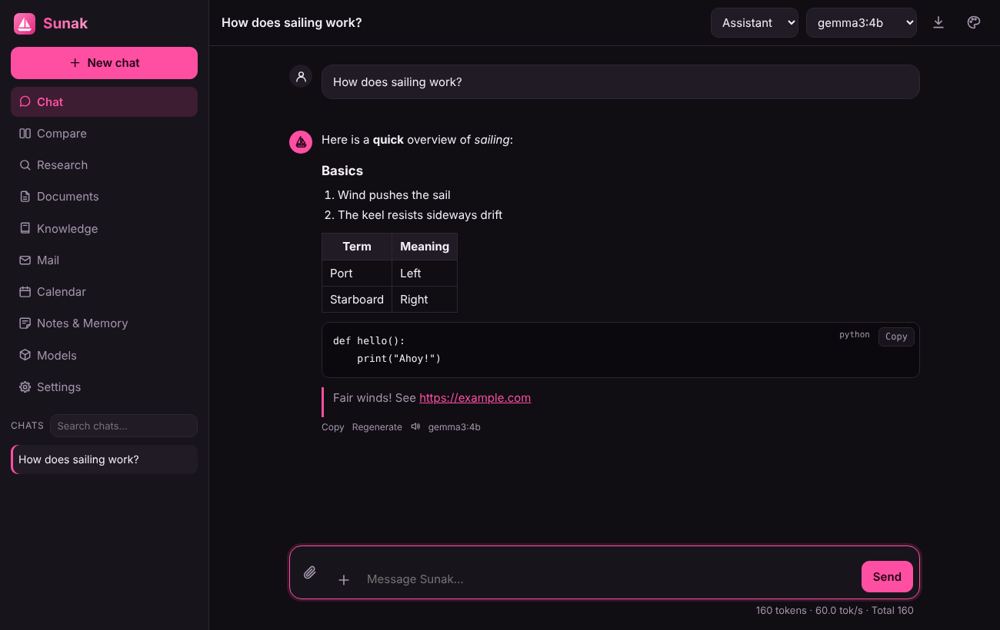
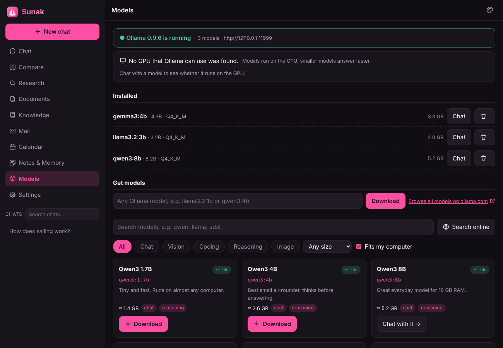
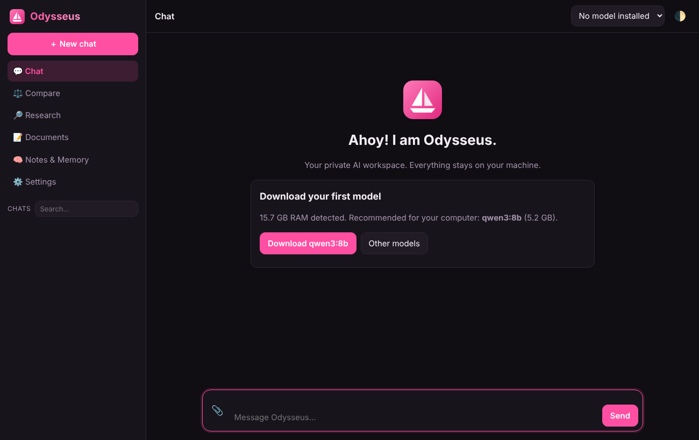
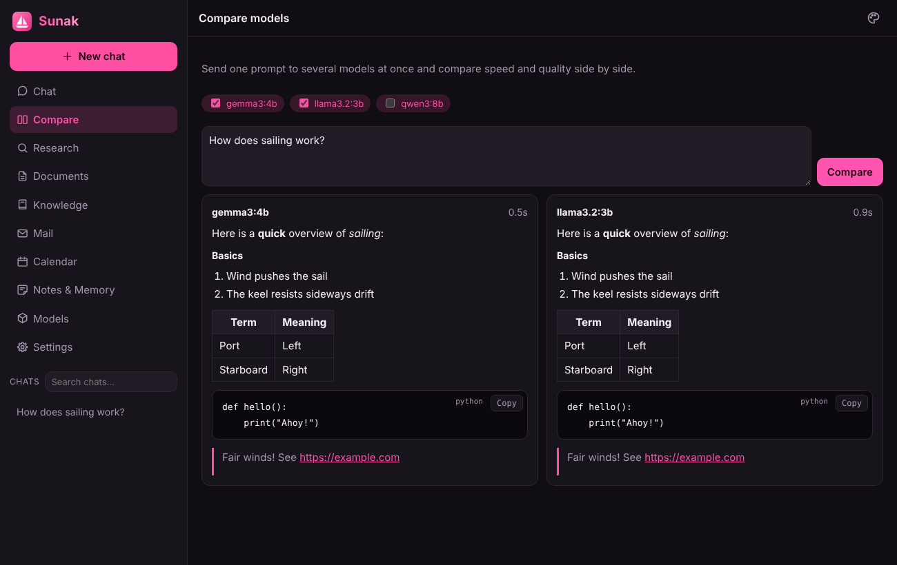

<p align="center">
  
</p>
<h1 align="center">Sunak</h1>
<p align="center">
  Dein privater KI-Arbeitsplatz: Chat, Modellvergleich, Web-Recherche, Dokumente und Gedächtnis.<br>
  Läuft komplett auf deinem Rechner, in Pink und mit Fokus auf einfache Installation.
</p>

> [!WARNING]
> **Komplett vibe coded.** Sunak wurde vollständig von einer KI (Claude) geschrieben, inklusive Installer, Tests und dieser Anleitung. Kein Mensch hat den Code Zeile für Zeile geprüft. Die automatischen Tests laufen zwar auf Linux, macOS und Windows, trotzdem können Fehler und Sicherheitslücken drin sein. Nutzung auf eigene Gefahr. Mach Sunak nicht ungeschützt im Internet erreichbar und leg keine sensiblen Daten hinein, ohne sie zusätzlich zu sichern.

<p align="center"></p>

**Inhalt:** [Installation](#installation) · [Erste Schritte](#erste-schritte) · [Funktionen](#funktionen) · [Anleitungen](#anleitungen) · [Befehle](#befehle-sunak--h) · [Konfiguration](#konfiguration) · [Aktualisieren und Deinstallieren](#aktualisieren-und-deinstallieren) · [Probleme](#wenn-etwas-nicht-klappt) · [Entwickeln](#entwickeln)

## Installation

Eine Zeile reicht. Sunak braucht **keine Python-Pakete**, nur Python 3.9 oder neuer, und der Installer besorgt es bei Bedarf.

**macOS / Linux**

```bash
curl -fsSL https://raw.githubusercontent.com/M4XM77R/sunak/main/install.sh | bash
```

**Windows** (PowerShell)

```powershell
irm https://raw.githubusercontent.com/M4XM77R/sunak/main/install.ps1 | iex
```

Der Installer

1. prüft Python 3.9+ und installiert es bei Bedarf,
2. legt den Befehl `sunak` an,
3. fragt, ob er ein Sunak-Icon auf den Desktop legen soll (Linux zusätzlich ins App-Menü, macOS als `Sunak.app` in `~/Applications`, Windows zusätzlich ins Startmenü). Das Icon startet Sunak ohne Terminalfenster oder öffnet es, wenn es schon läuft,
4. fragt, ob Sunak beim Anmelden automatisch im Hintergrund starten soll (Standard: nein),
5. zeigt, welche Grafikkarte Ollama nutzen kann, und bietet an, [Ollama](https://ollama.com) für lokale Modelle zu installieren,
6. startet Sunak und öffnet den Browser auf `http://localhost:7000`.

Ohne Terminal (zum Beispiel in einer Pipe ohne Eingabe) gelten bei Ja/Nein-Fragen die Vorgaben. Für eine Installation ganz ohne Fragen gibt es Optionen, siehe [Installer-Optionen](#installer-optionen).

**Ohne Installation ausprobieren:**

```bash
git clone https://github.com/M4XM77R/sunak.git
cd sunak
python3 start.py
```

Unter Windows reicht ein Doppelklick auf `start.py`. Der Befehl `sunak` gibt es so nicht, ein Update ist dann `git pull`.

**Docker (inklusive Ollama):**

```bash
docker compose up -d                                                   # nur CPU, http://localhost:7000
docker compose -f docker-compose.yml -f docker-compose.gpu.yml up -d   # mit NVIDIA-GPU
docker compose -f docker-compose.yml -f docker-compose.amd.yml up -d   # mit AMD-GPU (Linux)
```

Die Daten liegen dann im Ordner `data/` neben der Compose-Datei (Ollama-Modelle in `data/ollama/`). Der Port ist standardmäßig nur auf dem eigenen Rechner offen; mit `APP_BIND=0.0.0.0` (alle Netzwerke) und `APP_PORT=8123` (anderer Port) änderst du das, mit `SUNAK_PASSWORD=…` setzt du ein Passwort (alle drei als Umgebungsvariablen vor `docker compose`, oder in einer `.env`-Datei). Für NVIDIA braucht der Rechner den NVIDIA-Treiber und das [NVIDIA Container Toolkit](https://docs.nvidia.com/datacenter/cloud-native/container-toolkit/latest/install-guide.html), für AMD den `amdgpu`-Treiber (Linux, ROCm-Image `ollama/ollama:rocm`). Auf dem Mac kann Docker die GPU nicht nutzen; dort ist die normale Installation mit der Ollama-App schneller.

## Erste Schritte

1. Beim ersten Start erkennt Sunak deinen Arbeitsspeicher (und die Grafikkarte) und schlägt ein passendes Modell vor: bis 6 GB RAM `qwen3:1.7b`, bis 12 GB `qwen3:4b`, bis 24 GB `qwen3:8b`, darüber `qwen3:14b`. Passt ein größeres Modell komplett in den Grafikspeicher, schlägt Sunak das vor.
2. Ein Klick lädt das Modell herunter (mit Fortschrittsbalken, Abbrechen jederzeit möglich, beim nächsten Mal geht es weiter). Danach kannst du sofort chatten.
3. Lieber ein Cloud-Modell? Beim ersten Start „Use Claude with an API key“ wählen, oder später unter Settings → Providers einen Anbieter eintragen (Claude, OpenAI, OpenRouter, Groq, LM Studio, llama.cpp, vLLM).
4. Sunak beenden: Settings → Stop Sunak oder `sunak stop`. Wieder starten: Desktop-Icon oder `sunak`.

**Menünamen:** Die Oberfläche folgt der Sprache deines Browsers (Deutsch oder Englisch, umschaltbar unter Settings → Look → Language). Diese Anleitung nennt die Menüs englisch; auf Deutsch heißen sie:

| Englisch | Deutsch | Englisch | Deutsch |
|---|---|---|---|
| Settings | Einstellungen | Models | Modelle |
| Providers | Anbieter | Knowledge | Wissen |
| Look | Aussehen | Compare | Vergleichen |
| Data | Daten | Research | Recherchieren |
| Voice | Stimme | Documents | Dokumente |
| Mail accounts | E-Mail-Konten | Notes & Memory | Notizen & Gedächtnis |
| Calendars | Kalender | Mail | E-Mail |
| Tools (MCP) | Werkzeuge (MCP) | Image generation | Bildgenerierung |
| Security | Sicherheit | Phone & tablet | Handy & Tablet |

## Funktionen

| | |
|---|---|
| 💬 **Chat** | Streaming-Antworten, Volltextsuche über alle Chats, Export (Markdown, JSON, PDF), Bearbeiten und Neu generieren, Markdown, Tabellen, Code mit Kopier-Knopf, aufklappbarer Denkprozess von Reasoning-Modellen, Dateien und Bilder anhängen |
| 🤖 **Anbieter** | Ollama (lokal), Claude (Anthropic API) und jede OpenAI-kompatible API (OpenAI, OpenRouter, Groq, LM Studio, llama.cpp, vLLM) |
| 📚 **Knowledge** | Eigene Wissensbasis aus PDF, Word, OpenDocument, PowerPoint, HTML, Markdown, Text, CSV und Code, mit Quellenangabe in den Antworten |
| 🌐 **Web-Suche** | Globus-Knopf im Chat: Sunak sucht, liest die besten Seiten und antwortet mit Quellen |
| 🔎 **Research** | Gründlicher Bericht mit Quellen aus mehreren Suchen, als Dokument speicherbar |
| 📝 **Documents** | Markdown-Editor mit Autosave, Vorschau, Export und KI-Bearbeitung |
| 🧠 **Notes & Memory** | Notizen und ein Gedächtnis, das Sunak aus Chats selbst aufbaut |
| ✉️ **Mail** | Mehrere Konten per IMAP/SMTP, KI fasst zusammen, entwirft Antworten und sortiert den Posteingang |
| 📅 **Kalender** | Eigener Kalender, CalDAV und abonnierte Kalender; Termine aus einem Satz oder einer Mail |
| 🔢 **Token-Zähler** | Zählt je Profil die Tokens jeder Modellanfrage (Eingabe, Ausgabe, Cache) mit Tokens pro Sekunde und einer Gesamtsumme |
| 🔌 **Werkzeuge (MCP)** | Beliebige MCP-Server als Werkzeuge für das Modell |
| 🎨 **Bilder erzeugen** | Mit Sunaks eigenem Bildprogramm (stable-diffusion.cpp), Automatic1111 oder ComfyUI |
| 🖼 **Bilder verstehen** | Fotos und Screenshots an Vision-Modelle schicken |
| 🎤 **Sprechen und Vorlesen** | Diktieren (lokal mit Whisper oder Chrome) und Antworten vorlesen |
| ⚖️ **Compare** | Ein Prompt an 2 bis 4 Modelle gleichzeitig |
| 🎭 **Personas** | Systemprompts zum Umschalten (Assistant, Coder, Writer, Translator, Teacher und eigene) |
| 🧩 **Modelle** | Modellsuche, Katalog mit Empfehlungen, GPU-Erkennung, Ollama starten und installieren |
| 🎨 **Themes** | Acht Themes und eigene Akzentfarben, als App installierbar (PWA) |
| 🌍 **Sprachen** | Oberfläche auf Deutsch oder Englisch |
| 👥 **Profile** | Mehrere Personen an einem Sunak, mit eigenen Daten und optionaler PIN |
| 🐞 **Fehlerberichte** | Optional: unerwartete Fehler werden als GitHub-Issue gemeldet, ohne Chats, Prompts oder Schlüssel (standardmäßig aus) |
| 📱 **Handy-Zugriff** | Im WLAN per QR-Code |
| 🔒 **Sicherheit** | Standardmäßig nur auf `localhost`, optionales Passwort, Daten in einer SQLite-Datei |

<p align="center"></p>
<p align="center"> </p>

## Anleitungen

### Chat

| Aktion | So geht's |
|---|---|
| Senden / neue Zeile | `Enter` / `Shift+Enter` |
| Neuer Chat | `Strg+K` (Mac: `⌘K`) |
| Modell wechseln | Auswahl oben rechts |
| Persona wechseln | Auswahl oben neben dem Modell, gilt für den aktuellen Chat. Eigene Personas: Settings → Personas |
| Alte Chats finden | Suchfeld über der Chatliste: durchsucht Titel und alle Nachrichten, ein Klick springt zur Stelle |
| Chat exportieren | Download-Knopf oben rechts → Markdown, JSON oder Drucken/PDF |
| Alles sichern | Settings → Data → Download backup: eine JSON-Datei mit Chats, Dokumenten, Notizen, Wissensbasis, Einstellungen, Mail- und Kalender-Konten, aber ohne API-Keys und Passwörter |

**Das Eingabefeld:** Links daneben stehen die Büroklammer (Dateien und Bilder anhängen), das **+** und rechts Senden. Das **+**-Menü klappt nach oben auf und enthält Knowledge base, Web search, Tools (MCP) und Speak, jeweils mit Ein-/Aus-Schalter. Tools (MCP) erscheint nur, wenn ein Server eingeschaltet ist, und nur für Admin-Profile; Speak, solange die Spracheingabe nicht ausgeschaltet ist. So bleibt am Handy Platz zum Tippen.

**Dateien anhängen:** Büroklammer oder Drag & Drop. Text, PDF, Word und PowerPoint werden gelesen und zur Nachricht gelegt. Für viele Dateien dauerhaft ist die Wissensbasis besser.

**Fragen zu einem Bild:** Bild anhängen, ins Chatfenster ziehen oder einen Screenshot mit `Strg+V` einfügen, Frage dazuschreiben, senden. Nötig ist ein Modell mit Bildverständnis (z. B. `qwen2.5vl:7b` oder `gemma3:4b` unter Models, `llama3.2-vision`, oder Claude). Andere Modelle melden das sofort, die Nachricht bleibt dann im Eingabefeld. Erlaubt sind PNG, JPEG, GIF und WebP, bis 4 Bilder je Nachricht und 5 MB je Bild; Sunak verkleinert große Fotos vor dem Senden.

**Fragen zu eigenen Dateien (Knowledge):** Knowledge → Dateien hineinziehen (PDF, Word, OpenDocument, PowerPoint, HTML, Markdown, Text, CSV, Code) → im Chat über das **+** „Knowledge base“ einschalten. Die Antworten nennen die Dateien, aus denen sie stammen. Ist die Wissensbasis klein (bis etwa 8000 Zeichen), sieht das Modell alles, sonst die besten Abschnitte. Gescannte PDFs ohne Textebene und verschlüsselte PDFs kann Sunak nicht lesen. Alles bleibt lokal.

**Aktuelles fragen (Web-Suche):** Im **+**-Menü „Web search“ einschalten (gilt pro Chat, Standard aus), dann normal fragen. Sunak sucht bei DuckDuckGo (ohne Konto; blockiert DuckDuckGo oder ist es nicht erreichbar, probiert Sunak DuckDuckGo Lite und Bing) oder bei deiner eigenen SearXNG-Instanz (`SEARXNG_URL`), liest bis zu vier Seiten, und das Modell antwortet mit Quellen [1], [2], die über der Antwort anklickbar sind. Bei Folgefragen formuliert das Modell die Suchanfrage selbst. Dabei geht die Suchanfrage ins Netz. Für einen ausführlichen Bericht gibt es **Research**: Das Modell plant bis zu drei Suchen (liefert es nichts Brauchbares, etwa nur Gedanken wie manche Qwen-Modelle, sucht Sunak mit deiner Frage selbst), liest bis zu fünf Seiten und schreibt einen Bericht mit Quellen, den du als Dokument speichern kannst. Schreibst du in Research einen Bildwunsch, malt Sunak ihn in einem neuen Chat, statt dazu zu recherchieren. Klappt die Suche nicht, steht in der Fehlermeldung, warum (Suchmaschine blockiert, nicht erreichbar) und wie du es umgehst (`SEARXNG_URL`); „found nothing“ heißt, die Suche lief, fand aber nichts.

**Cloud-Modell nutzen:** Settings → Providers → Preset wählen (zum Beispiel „Claude (Anthropic)“, API-Key von [console.anthropic.com](https://console.anthropic.com)) → Key eintragen → Save settings. Keys bleiben auf dem Rechner und gehen nie zurück an den Browser. Mit der Umgebungsvariable `ANTHROPIC_API_KEY` richtet Sunak Claude beim ersten Start selbst ein.

### Automatisches Gedächtnis

Nach einer Antwort schaut das Modell des Chats, ob die letzte Frage und Antwort dauerhafte Fakten über dich enthalten (Name, Beruf, Vorlieben für Antworten) und legt sie als Notiz mit Markierung „memory“ ab, höchstens drei pro Antwort. Du siehst es als Hinweis mit **Undo** und unter Notes & Memory, dort mit dem Herkunftschat. Alle Gedächtnis-Notizen kennt die KI in jedem Chat. „Merk dir …“ oder „Remember that …“ wird immer gespeichert, Passwörter, Schlüssel, PINs und Kartennummern nie. Mit Werkzeugen (MCP), nach Bildern und bei ausgeschaltetem Gedächtnis läuft das nicht. Ausschalten: Settings → Chat → „Remember things about me from chats by itself“ (nur die automatische Hälfte) oder „Use memory notes in chats“ (gar kein Gedächtnis).

### Modelle, GPU und Suche

Sunak rechnet nicht selbst, die Modelle laufen in Ollama. Ollama nutzt eine passende GPU automatisch: NVIDIA über CUDA, AMD über ROCm, Apple Silicon über Metal. Der Ollama-Installer richtet dafür alles ein, die NVIDIA-Karte braucht nur den normalen Treiber. Ohne passende GPU (NVIDIA oder AMD mit mindestens 3 GB Grafikspeicher, oder Apple Silicon) laufen die Modelle auf dem Prozessor, dann sind kleine Modelle die bessere Wahl.

- `sunak gpu` zeigt, welche GPU Sunak gefunden hat; die Installer melden das ebenfalls.
- Die Seite **Models** (nur Admin-Profile) zeigt GPU und Grafikspeicher, markiert Modelle, die komplett hineinpassen, mit „fits GPU“, und zeigt pro geladenem Modell, ob es auf der GPU oder dem Prozessor läuft. Läuft Ollama trotz GPU auf dem Prozessor, erscheint eine Warnung mit Lösungshinweis.
- Ollama lässt sich aus Sunak heraus starten, unter Windows (winget) und macOS (Homebrew) auch installieren; unter Linux zeigt Sunak den Befehl des offiziellen Installers.
- **Modell laden:** Models → Modell aussuchen → Download. Jedes Ollama-Modell geht auch per Name. Installierte Modelle lassen sich dort löschen.
- **Modelle suchen:** Das Suchfeld filtert sofort Sunaks Katalog (Filter: Chat, Bilder verstehen, Programmieren, Logik, Bild; Größe; „passt zu meinem Computer“). „Search online“ fragt zusätzlich ollama.com und Hugging Face; ohne Netz bleibt es still beim eigenen Katalog. Bei Hugging-Face-Treffern zeigt „Show files“ Größe, Quantisierung und Lizenz, Download lädt das GGUF-Modell über Ollama (`hf.co/…`) bzw. ein Bildmodell in Sunaks Bildprogramm. Modelle, die eine Anmeldung bei Hugging Face verlangen, kann Sunak nicht laden.
- AMD-Karten, die ROCm nicht offiziell unterstützt, laufen oft mit `HSA_OVERRIDE_GFX_VERSION` (zum Beispiel `10.3.0` für RX 6000, `11.0.0` für RX 7000), gesetzt für den Ollama-Dienst bzw. im `ollama`-Container. Details: [docs.ollama.com/gpu](https://docs.ollama.com/gpu).

### Werkzeuge (MCP)

MCP-Server (Model Context Protocol) geben dem Modell Werkzeuge: Dateien, Webseiten lesen, Uhrzeit, Gedächtnis oder jeden anderen MCP-Server, als Programm auf dem Computer (stdio) oder über eine Adresse (Streamable HTTP).

1. Settings → Tools (MCP) → „Preset…“ wählen (Files in a folder, Read web pages, Time, Memory) oder „Add server“.
2. Name, Typ „Program“ mit dem Startbefehl (z. B. `npx -y @modelcontextprotocol/server-memory`, braucht Node.js; `uvx mcp-server-fetch` braucht uv) oder „Address (HTTP)“ mit der URL und optional einem Token.
3. Geheimnisse wie API-Keys des Servers als `NAME=Wert` unter den Umgebungsvariablen eintragen. Sie bleiben auf dem Computer und gehen nie zurück an den Browser.
4. „Test“ startet den Server einmal und zeigt seine Werkzeuge, dann Save settings.
5. Im Chat über das **+** „Tools (MCP)“ einschalten.

Vor jedem Werkzeugaufruf fragt Sunak („Allow“, „Allow … in this chat“, „Deny“) und zeigt die Eingabe. Nur Admin-Profile richten Server ein und nutzen sie; ein Programm-Server läuft mit deinen Rechten.

### Mehrere Nutzer gleichzeitig

Sunak kann von mehreren Personen gleichzeitig benutzt werden (Handy-Zugriff und Profile siehe oben). Damit ein Rechner nicht an mehreren großen Anfragen gleichzeitig erstickt, stehen Anfragen an ein Modell in einer Warteschlange, **first in, first out**: Wer zuerst fragt, wird zuerst bedient. Jedes Backend hat seine eigene Reihe (jedes Chatmodell-Programm für sich, der Bildgenerator für sich). Wartet deine Anfrage, steht im Chat „Waiting in the queue: place n“ (mit Werkzeugen als Hinweis, bei Bildern im Platzhalter); sobald sie dran ist, läuft sie wie gewohnt. **Stop** oder das Schließen der Seite nimmt eine wartende Anfrage aus der Reihe. Ein lokales Modell bearbeitet eine Anfrage nach der anderen (`SUNAK_MODEL_SLOTS` ändert das), ein Modell im Internet vier gleichzeitig. Mit Werkzeugen (MCP) zählt jeder Modellaufruf einzeln; das Warten auf deine Bestätigung blockiert niemanden.

### Bilder erzeugen

Bildwünsche im Chat macht Sunak von selbst, ohne Rückfrage und mit jedem Chatmodell: Schreibst du „mach mir ein Bild von einem Leuchtturm im Querformat“, „mal mir eine Katze“, „Bild von einem Fuchs“, „a picture of: a snowy landscape“ oder „generate an image of …“ (Deutsch und Englisch; nicht bei Anhängen), schreibt zuerst das Chatmodell aus deiner Bitte einen besseren englischen Prompt, und der geht an das Bildmodell. Sobald Bilder eingerichtet sind, fragt Sunak bei jeder Nachricht, die nicht schon eindeutig ein Bildwunsch ist („generiere mir ein Bild von …“ wird ohne Rückfrage gemalt), das Chatmodell kurz mit Ja oder Nein, ob sie einer ist (nur die letzte Nachricht, nur die ersten Wörter der Antwort; so werden auch Sätze ohne Bildwort wie „Ein Fuchs im Schnee, fotorealistisch“ erkannt, und „Wie erstelle ich ein Bild in Photoshop?“ bleibt ein Chat). Das kostet einen kleinen Zusatzaufruf je Nachricht und lässt sich in Settings → Image generation unter „Recognise picture requests with the AI“ abschalten. Antwortet das Modell nicht (Fehler, über 15 Sekunden, oder es ist gerade mit anderen Anfragen beschäftigt), entscheiden Muster: alles, was nicht eindeutig ist, geht als normaler Chat. Eindeutig sind Bitten wie „generiere mir ein Bild von …“, „a picture of: …“ oder „draw a cat“. Unter dem Bild stehen der „Improved prompt“, Größe, Seed und Schritte; „Again“ malt mit demselben Prompt eine neue Variante, Download und Stop (bricht auch eine wartende Anfrage ab) gibt es auch. Das Format folgt dem Wunsch (Querformat/landscape, Hochformat/portrait, sonst quadratisch). Klappt die Verbesserung nicht, geht deine Beschreibung unverändert an das Bildmodell. Die Bilder bleiben im Chat. Standardmäßig ist die Bildgenerierung aus; solange sie nicht eingerichtet ist, nennt ein Hinweis bei einem Bildwunsch den fehlenden Schritt, und die Nachricht geht als normaler Chat an das Modell.

**Mit Sunaks eigenem Bildprogramm (stable-diffusion.cpp), ohne Python-Pakete:**

1. Models → Filter „Image“ → „Set up the image program“: Sunak schlägt die passende Version vor (NVIDIA: CUDA, andere Grafikkarten: Vulkan, Mac: Metal, sonst nur Prozessor), Install. Das Programm ist je nach Version etwa 20 bis 500 MB groß (CUDA am größten).
2. Ein Bildmodell herunterladen: SD-Turbo (für den Anfang, 5 GB), SD 1.5, SDXL-Turbo, SDXL oder per Suche von Hugging Face, mit Lizenzhinweis, Fortschritt, Pause/Fortsetzen und Löschen. Modelle sind 4 bis 8 GB groß.
3. Im Chat um ein Bild bitten. Sunak führt durch die Schritte: Fehlt noch etwas, steht auf der Models-Seite „Next step“, und ein Bildwunsch im Chat nennt, was fehlt. Sind Programm und Modell da, wählt Sunak das Modell selbst.

Mit Grafikkarte dauert ein Bild Sekunden, nur mit dem Prozessor eine bis mehrere Minuten. Fehlermeldungen des Programms erscheinen im Chat.

**Mit Automatic1111 / Forge / ComfyUI:** Ein Stable-Diffusion-Programm installieren, z. B. [Automatic1111](https://github.com/AUTOMATIC1111/stable-diffusion-webui) bzw. Forge (mit der Option `--api` starten) oder [ComfyUI](https://github.com/comfyanonymous/ComfyUI), und ein Modell hineinlegen. Dann Settings → Image generation → Programm wählen, Adresse leer lassen für die übliche lokale (`http://127.0.0.1:7860` bzw. `:8188`), „Test“ zeigt die Modelle → Save settings. Für SDXL- und Flux-Modelle die Bildgröße 1024 px wählen.

### Sprechen und Vorlesen

- **Diktieren:** Im **+**-Menü „Speak“ klicken, sprechen, noch einmal klicken; der Text landet im Eingabefeld, gesendet wird erst auf Klick.
- **Ganz lokal mit Whisper:** z. B. whisper.cpp mit `whisper-server -m ggml-base.bin` starten und unter Settings → Voice `http://localhost:8080/inference` eintragen (Speaches/faster-whisper-server/LocalAI: `http://localhost:8000/v1` und den Modellnamen).
- **Ohne Whisper** nutzt Sunak die Offline-Erkennung von Google Chrome (ab Version 139). Die normale Online-Erkennung (Chrome schickt den Ton an Google) nur, wenn sie unter Settings → Voice erlaubt ist; dort lässt sich das Mikrofon auch ganz ausschalten.
- Das Mikrofon geht nur am Computer selbst (`localhost`) oder über https, nicht über den Handy-Zugriff; am Handy hilft das Diktieren der Tastatur.
- **Vorlesen:** Lautsprecher unter einer Antwort, noch einmal klicken stoppt. Es nutzt die Stimmen des Geräts; Stimme wählen unter Settings → Voice (pro Gerät, mit ▶ Test).

### E-Mail

Sunak spricht IMAP (lesen) und SMTP (senden) direkt mit der Python-Standardbibliothek, ohne Zusatzpakete und ohne Umweg über fremde Server.

**Konto verknüpfen:** Settings → Mail accounts → Add mail account → Adresse und App-Passwort eintragen (die Server werden für Gmail, Outlook, iCloud, Yahoo, GMX, WEB.DE und Telekom automatisch ausgefüllt, eigene Server gehen auch) → Test connection → Save account. Beliebig viele Konten. Mails mit KI bearbeiten: Mail → Mail öffnen → Summarize, Reply und dann Draft reply (optional mit Hinweis wie „zusagen, aber erst nächste Woche“), oder „Ask in chat“; „Overview“ sortiert den Posteingang („was braucht eine Antwort, was kann warten“).

Was geht: Posteingang je Konto, Ordner, Suche, Mails lesen ohne sie als gelesen zu markieren, Anhänge herunterladen, Antworten, Weiterleiten (mit den Anhängen), eigene Anhänge, Entwürfe, Verschieben, Löschen über den Papierkorb.

- **App-Passwort:** Gmail, iCloud und Yahoo verlangen ein App-Passwort statt des normalen Passworts (bei Gmail erst nach Einschalten der Bestätigung in zwei Schritten, dann unter https://myaccount.google.com/apppasswords). Bei GMX und WEB.DE muss IMAP vorher in den Einstellungen des Postfachs freigeschaltet werden, bei der Telekom gilt das eigene E-Mail-Passwort. Sunak zeigt beim Einrichten den passenden Hinweis.
- **Sicherheit:** Passwörter liegen wie API-Keys nur in der lokalen Datenbank, werden nie protokolliert und nie an den Browser zurückgegeben; das Backup enthält sie nicht. Verbindungen laufen über SSL/TLS oder STARTTLS mit Zertifikatsprüfung. Unverschlüsselt (und mit selbst signiertem Zertifikat) verbindet Sunak sich nur mit `localhost`, etwa mit der Proton Mail Bridge.
- **Nichts passiert von selbst:** Ordner werden nur lesend geöffnet, Mails bleiben ungelesen. Gesendet wird nur nach Klick auf **Send** und einer Rückfrage, Entwürfe landen nur mit **Save draft** im Entwürfe-Ordner. KI-Antworten erscheinen als Entwurf im Formular.
- **Anhänge:** Die Büroklammer im Formular hängt Dateien an (zusammen höchstens 17 MB). Beim Weiterleiten gehen die Anhänge der Original-Mail mit; jeder lässt sich vorher mit dem x entfernen.
- **Verschieben und Löschen:** In der Leseansicht „Move to…“ und Delete. Löschen verschiebt nach Rückfrage in den Papierkorb; endgültig gelöscht wird nur im Papierkorb (oder bei Konten ohne Papierkorb), mit eigener Rückfrage. Bei Gmail sind Ordner Labels: Verschieben nimmt das alte Label weg und setzt das neue, Löschen legt die Mail in den Papierkorb, wo Google sie nach 30 Tagen selbst entfernt.
- **Neue Mails:** Solange Sunak offen ist, schaut es alle 2 Minuten in jeden Posteingang (nur lesend). Neue ungelesene Mails melden sich mit einem Hinweis, am Knopf Mail steht die Zahl der ungelesenen. Mit „Also as desktop notification“ (Settings → Mail accounts) kommt die Meldung auch als Desktop-Benachrichtigung, wenn Sunak im Hintergrund ist (nur über `localhost` oder https). Abschalten: Haken bei „Tell me about new mail“ entfernen.
- **Mail-Inhalt ist kein Befehl:** Die KI bekommt Mails ausdrücklich als Daten von Dritten und soll Anweisungen darin ignorieren. Sie hat ohnehin keine Werkzeuge und kann selbst nichts senden.
- **Echtes Konto testen:** `sunak mail-selftest` (mit `--account adresse` bei mehreren Konten) prüft ein verknüpftes Konto Schritt für Schritt gegen den echten Anbieter: Anmeldung, Posteingang lesen, Hinweis auf neue Mail, Senden an sich selbst mit Anhang, Weiterleiten als Entwurf, Verschieben, Löschen. Jede Testmail trägt eine Zufallsmarke im Betreff, nur diese Mails werden angefasst und am Ende endgültig gelöscht (`--keep` behält sie). Das Passwort wird nie ausgegeben; mit `--new` tippst du Adresse und App-Passwort stattdessen ein (nicht gespeichert).

**Grenzen (ehrlich):**

- **Kein OAuth.** Anmeldung geht nur per Passwort bzw. App-Passwort. OAuth bräuchte eine bei Google bzw. Microsoft registrierte App; das lässt sich ohne fremden Dienst nicht sauber mitliefern. Microsoft (Outlook, Hotmail, Microsoft 365) erlaubt für fremde Programme oft nur noch OAuth. Lehnt der Server die Anmeldung ab, funktioniert das Konto in Sunak nicht.
- HTML-Mails werden als Text angezeigt (keine Bilder, keine Formatierung, dafür auch kein Tracking).
- Der Hinweis auf neue Mail kommt nur, solange Sunak im Browser offen ist (kein Hintergrunddienst, kein IMAP IDLE), mit bis zu 2 Minuten Verzug. Jede Aktion baut eine neue Verbindung auf, das dauert je nach Anbieter ein bis zwei Sekunden.
- Verschieben und Löschen gehen je Mail, nicht für mehrere auf einmal.
- Die automatischen Tests laufen gegen simulierte Server; gegen einen echten Anbieter prüft `sunak mail-selftest` auf deinem Rechner.

### Kalender

Monatsansicht mit allen Kalendern: Sunaks eigener Kalender, CalDAV-Konten (iCloud, GMX, WEB.DE, Yahoo, mailbox.org, Posteo, Fastmail, Nextcloud oder eigene Adresse) und abonnierte Kalenderadressen (ICS, z. B. Google oder Outlook, nur lesen). Termine anlegen, ändern und löschen, auch ganztägig und wiederkehrend; Wiederholungen, Zeitzonen und Sommerzeit werden richtig gerechnet. Welche Kalender angezeigt werden, wählst du in der Liste rechts im Kalender.

- **Verbinden:** Settings → Calendars → „Add calendar“. Für CalDAV unter „Own login“ ein verknüpftes Mail-Konto wählen (Adresse und Benutzername werden ausgefüllt, das Passwort des Mail-Kontos wird verwendet) oder Anbieter, Benutzername und (App-)Passwort eintragen. Google und Outlook.com bieten kein CalDAV mit Passwort: dort die geheime iCal-Adresse als „ICS address“ abonnieren.
- **Termin aus Text:** Im Kalender Satz eintippen („Zahnarzt nächsten Dienstag 10 Uhr“) und „Add“ klicken, oder in einer Mail „Add to calendar“. Das Modell füllt das Formular aus; gespeichert wird erst nach deinem Klick.
- **Grenzen:** Wiederholungen nach Kalenderwoche oder Jahrestag und stündliche Wiederholungen werden nicht unterstützt. ICS-Abos werden 5 Minuten zwischengespeichert.

### Profile

Mehrere Personen an einem Sunak: Jedes Profil hat eigene Chats, Dokumente, Notizen, Wissensbasis, Mail-Konten, Kalender, Personas, Theme und Sprache, auf Wunsch mit PIN. Anbieter, Modelle und MCP-Server sind gemeinsam. Auch der Token-Zähler gehört zum Profil.

- **Anlegen:** Settings → Profile → „Add profile“: Name, optional ein eigenes Emoji, optional PIN (mindestens 4 Zeichen) und ob das Profil Admin sein soll. Beim nächsten Öffnen fragt Sunak „Who is using Sunak?“; gewechselt wird über den Namen oben links.
- Das erste Profil ist das Hauptprofil mit allen bisherigen Daten, es bleibt immer Admin und lässt sich nicht löschen.
- **Rechte:** Nur Admin-Profile ändern Anbieter, Modelle, Werkzeuge, Bildgenerierung, Spracheingabe, Updates, Fehlerberichte, Handy-Zugriff, Passwort und Profile.
- Eine PIN trennt die Profile in der App, schützt aber nicht vor jemandem, der am Computer die Dateien unter `~/.sunak` öffnen kann. Das Passwort (Security) gilt für die ganze Installation.

### Token-Zähler

Sunak zählt für jede Modellanfrage die Tokens und merkt sich: Zeitpunkt, Anbieter, Modell, Eingabe, Ausgabe, Cache gelesen, Cache geschrieben, Dauer und Tokens pro Sekunde. Das gilt für Ollama, Claude und OpenAI-kompatible Anbieter, auch mit Werkzeugen (MCP). Die Zahlen liegen in der Datenbank des Profils und bleiben nach einem Neustart erhalten.

- **Anzeige:** Unter dem Eingabefeld steht nach der ersten gezählten Anfrage eine Zeile mit den Tokens und Tokens pro Sekunde der letzten Anfrage und der Gesamtsumme; ein Klick öffnet Settings → Token counter. Dort stehen die letzte Anfrage im Detail, die Gesamtsumme, Eingabe, Ausgabe, Cache gelesen und geschrieben getrennt und der Teil, den Sunak von selbst angefragt hat. Admin-Profile sehen zusätzlich die Summe aller Profile.
- **Je Profil:** Jedes Profil hat seinen eigenen Zähler und sieht nur den eigenen.
- **Was zählt:** Die Gesamtsumme besteht aus Eingabe, Ausgabe, gelesenem und geschriebenem Cache. Auch Anfragen, die Sunak selbst stellt (Bildprüfung, Merken von Fakten, Verbessern von Bildprompts), zählen mit und sind getrennt ausgewiesen. „Letzte Anfrage“ ist die letzte, die du ausgelöst hast, nicht eine dieser Hintergrundanfragen. Bricht eine Anfrage ab oder wird gestoppt, zählt Sunak, was bis dahin gemeldet wurde (bei Claude die Eingabe; die Ausgabe bleibt leer, weil Claude sie erst am Ende meldet).
- **Woher die Zahlen kommen:** Ollama meldet sie am Ende der Antwort (Tokens pro Sekunde aus `eval_count` und `eval_duration`), Claude in `usage` (Tokens pro Sekunde aus der gemessenen Zeit zwischen erstem und letztem Ausgabeteil), OpenAI-kompatible Server mit der Option `stream_options` (Sunak fragt sie mit; lehnt ein Server sie ab, fragt Sunak ohne und merkt es sich). Meldet ein Anbieter eine Zahl nicht, bleibt sie leer („–“) und wird nicht geschätzt, zum Beispiel der Cache bei Ollama.
- **Nie ein Fehler:** Scheitert das Zählen, wird still ins Log geschrieben und die Anfrage läuft normal weiter.

### Fehlerberichte

Damit Fehler gefunden und behoben werden können, kann Sunak unerwartete Fehler als **Issue auf GitHub** melden (Repository `M4XM77R/Sunak`, mit dem Label `auto-report`). **Diese Issues sind öffentlich: Jeder kann sie lesen.** Das ist **standardmäßig aus** und nur für Admin-Profile unter Settings → Error reports (Fehlerberichte) einstellbar:

- **Off:** nichts wird gesammelt oder gesendet.
- **Ask me first:** Fehler warten in den Einstellungen. Du siehst mit „Show what would be sent“ den ganzen Bericht und sendest ihn oder verwirfst ihn („Dismiss“). Nach dem Start weist ein Hinweis darauf hin, wenn Berichte warten.
- **Send automatically:** Sunak sendet jeden neuen Fehler sofort, ohne dass du ihn vorher siehst (beim Einschalten fragt Sunak noch einmal nach, weil die Berichte öffentlich sind). Das geht nur, wenn ein Token gespeichert ist; ohne Token warten die Berichte wie bei „Ask me first“.

**Was im Bericht steht:** Sunak-Version, Betriebssystem, Python-Version, Fehlerart und gekürzter Fehlertext, der Stacktrace (Dateien und Funktionen von Sunak mit ihren Codezeilen, keine Variablenwerte) und die letzten 30 Logzeilen. **Nie:** Chats, Prompts, Antworten, Inhalte von Mails oder Dateien, API-Schlüssel, Passwörter oder das Token. Weil die Issues öffentlich sind, wird streng geschwärzt: private Pfade und Dateinamen (`<path>`), Benutzer- und Rechnername, Adressen von Servern im Heimnetz oder im Internet außer bekannten wie github.com (`<host>`), IP- und MAC-Adressen, E-Mail-Adressen und lange Texte in Anführungszeichen, die aus einem Chat oder Dokument stammen könnten (`<text>`). Wer sichergehen will, nutzt „Ask me first“ und liest jeden Bericht vor dem Senden.

**Das Token (für den, dem das Repository gehört):** Lege auf GitHub unter Settings → Developer settings → Personal access tokens → Fine-grained tokens ein Token an, das **nur dieses Repository** und nur die Berechtigung „Issues: Read and write“ hat, und speichere es unter „Save token“. Es bleibt auf deinem Computer (nur in der Datenbank, nie im Log, im Backup oder im Browser). „Check access“ prüft, ob es funktioniert. Ein solches Token kann nur schreiben, wer das Repository besitzt oder Mitarbeiter ist; wer das Projekt nur nutzt, meldet Fehler mit **„Open on GitHub“**: Das öffnet ein vorausgefülltes Issue im Browser, das er mit seinem eigenen GitHub-Konto abschickt (ein klassisches Token mit `public_repo` ginge auch, ist aber zu mächtig und wird nicht empfohlen). Mit einem eigenen Fork lässt sich das Ziel über `SUNAK_REPORT_REPO` ändern.

**Wer braucht ein GitHub-Konto?** Nur, wer Berichte sendet: der Besitzer mit seinem Token (dann melden auch andere Profile und Geräte derselben Installation ohne eigenes Konto, denn das Token liegt nur auf dem Server) oder jeder, der „Open on GitHub“ nutzt. Ein Token im Programm mitzuliefern wäre nicht sicher, darum gibt es keinen Sammeldienst ohne Konto.

**Doppelte und Menge:** Jeder Fehler hat einen Fingerabdruck (Fehlerart plus die beteiligten Funktionen, ohne Zeilennummern). Gibt es dazu schon ein offenes Issue, bekommt es nur einen kurzen Kommentar („Seen again“, höchstens einen pro Tag); ein bereits geschlossenes Issue wird nicht geöffnet, sondern es entsteht ein neues, das darauf verweist. Pro Stunde entstehen höchstens drei neue Issues. „Create a sample report“ legt einen harmlosen Beispielbericht an, mit dem du die Vorschau und das Senden ausprobieren kannst.

### Handy und Tablet

1. Settings → Security: Passwort setzen (ohne Passwort geht der Handy-Zugriff nicht).
2. Settings → Phone & tablet → „Allow phones and tablets in my network“ einschalten.
3. Den QR-Code mit der Handykamera scannen (oder die angezeigte Adresse eintippen). Handy und Computer müssen im selben WLAN sein, der Computer muss an bleiben; fragt die Firewall, Python erlauben.
4. Für ein App-Icon im Browsermenü „Zum Startbildschirm hinzufügen“ wählen.

Die Einstellung bleibt nach einem Neustart erhalten. Startest du Sunak mit `--host 0.0.0.0`, ist es ohnehin im Netz erreichbar; dann zeigt die Seite nur Adresse und Code. Über `http://` im WLAN geht das Mikrofon nicht (Browser verlangen dafür https). Greifst du über einen eigenen Domainnamen zu (z. B. hinter einem Reverse-Proxy), trage ihn in `SUNAK_ALLOWED_HOSTS` ein, siehe [Konfiguration](#konfiguration).

### Themes und Sprache

- **Themes:** Sunak Dark und Sunak Light (Pink), Retro (grünes Terminal mit Monospace-Schrift), Cyberpunk (Neon), Ocean, Forest, Sunset (hell und warm) und 80s Corporate (beige Bürotechnik, marineblaue Titelleiste, Bordeaux, kantige Knöpfe mit 3D-Rand). Umschalten mit dem Paletten-Knopf oben rechts oder mit Vorschau in Settings → Look, dazu eigene Akzentfarben. Alle Themes sind auf gute Lesbarkeit geprüft. Das Theme gilt pro Profil.
- **Sprache:** Settings → Look → Language. „Automatisch“ folgt der Sprache des Browsers; die Seite lädt danach neu. Weitere Sprachen lassen sich als eine Datei ergänzen (siehe [Architektur](docs/ARCHITECTURE.md#sprachen)).
- **App:** Sunak ist als Web-App installierbar (PWA), wo der Browser das erlaubt (auf `localhost` oder mit https).

## Befehle (`sunak -h`)

`sunak -h` zeigt alle Befehle und Startoptionen gruppiert mit je einem Beispiel, `sunak <befehl> -h` (oder `sunak help <befehl>`) die Details eines Befehls. Bei Tippfehlern schlägt Sunak den passenden Befehl vor. Farben lassen sich mit `NO_COLOR=1` abschalten.

| Befehl | Zweck |
|---|---|
| `sunak` | Sunak starten und im Browser öffnen (läuft es schon, wird nur der Browser geöffnet) |
| `sunak status` | Läuft Sunak? Adresse und Autostart |
| `sunak stop` | Das laufende Sunak beenden |
| `sunak update` | Neueste Version installieren und ein laufendes Sunak beenden (danach `sunak` starten) |
| `sunak version` | Installierte Version (auch `sunak --version`, und unten in den Settings) |
| `sunak gpu` | Welche Grafikkarte Ollama nutzen kann |
| `sunak logs [ZEILEN]` | Wo die Logdatei liegt, und ihre letzten Zeilen (Standard 40; `--data-dir PFAD` für einen anderen Datenordner) |
| `sunak mail-selftest` | Ein echtes Mail-Konto von Anfang bis Ende testen, siehe [E-Mail](#e-mail) |
| `sunak autostart on\|off\|status` | Sunak beim Anmelden im Hintergrund starten |
| `sunak shortcut` | Desktop-Icon neu anlegen |
| `sunak uninstall` | Sunak entfernen, fragt vor dem Löschen von Daten |
| `sunak help <befehl>` | Details zu einem Befehl |

**Startoptionen:** `--port N` (erster Port, den Sunak probiert; Standard 7000, ist er belegt, wird bis zu neun Ports weitergezählt), `--host ADRESSE` (Standard `127.0.0.1`; `0.0.0.0` für Zugriff aus dem Netzwerk, dann unbedingt ein Passwort setzen), `--data-dir PFAD` (Datenordner, Standard `~/.sunak`), `--no-browser`, `--version`. `status` und `stop` suchen auf dem Port und den neun danach (`--port N` wählt einen anderen Startpunkt).

## Konfiguration

Alles Wichtige stellst du in der Oberfläche ein (Settings). Optional per Umgebungsvariable:

| Variable | Standard | Zweck |
|---|---|---|
| `SUNAK_PORT` | `7000` | Port (ist er belegt, wird der nächste freie genommen) |
| `SUNAK_HOST` | `127.0.0.1` | `0.0.0.0` für Zugriff aus dem Netzwerk |
| `SUNAK_DATA` | `~/.sunak` | Ordner für die Datenbank (Windows: `C:\Users\<Name>\.sunak`) |
| `SUNAK_PASSWORD` | – | Passwort beim Start setzen |
| `SUNAK_NO_BROWSER` | – | Auf einen beliebigen Wert setzen: Browser nicht öffnen |
| `SUNAK_DEBUG` | – | Auf einen beliebigen Wert setzen: ausführlicheres Log (Stufe DEBUG: auch jede lesende Anfrage, Seiten und Abfragen im Hintergrund). Nie Inhalte von Chats, Prompts oder Schlüssel |
| `SUNAK_REPORT_REPO` | `M4XM77R/Sunak` | GitHub-Repository (`besitzer/name`), in dem Fehlerberichte als Issues landen, zum Beispiel für einen eigenen Fork |
| `SUNAK_MODEL_SLOTS` | `1` | Wie viele Anfragen ein lokales Modell (Ollama auf diesem Rechner oder im LAN) gleichzeitig bearbeitet; weitere warten in der Reihe. Modelle im Internet (Claude, OpenAI) nehmen vier gleichzeitig |
| `SUNAK_ALLOWED_HOSTS` | – | Weitere Hostnamen, unter denen Sunak erreichbar ist, kommagetrennt (`*` für alle). Erlaubt sind sonst `localhost`, IP-Adressen, Namen ohne Punkt und `*.local` (Schutz gegen DNS-Rebinding) |
| `SUNAK_GPU` | – | Nur für Docker: `nvidia` oder `amd`, damit die CPU-Warnung auch dort greift (setzen die GPU-Compose-Dateien selbst) |
| `OLLAMA_BASE_URL` | `http://localhost:11434` | Ollama-Adresse beim ersten Start |
| `ANTHROPIC_API_KEY` | – | Richtet beim ersten Start automatisch Claude als Anbieter ein |
| `SEARXNG_URL` | – | eigene SearXNG-Instanz für Web-Suche und Research statt DuckDuckGo |
| `NO_COLOR` | – | Keine Farben in der Terminal-Ausgabe |

**Log:** Sunak schreibt, was es tut, in das Terminal, aus dem es gestartet wurde, und in die Datei `~/.sunak/logs/sunak.log` (im Datenordner, nur für dich lesbar). Jede Zeile hat Uhrzeit, Stufe und Bereich, zum Beispiel `13:11:54 INFO    http     POST /api/chat 200 3.4s`. Protokolliert werden Start und Ende, Anfragen, die etwas ändern (Methode, Pfad, Status, Dauer; Fehler als WARNING oder ERROR), die Warteschlange („busy, the request waits“), Bildaufträge, Update-Prüfungen und Fehler mit ihrer Ursache. **Nie** stehen darin Chats, Prompts, Antworten, Mails, Dateiinhalte, Passwörter, API-Schlüssel oder Query-Texte (auch nicht mit `SUNAK_DEBUG`). Die Datei ist auf **50 MB** begrenzt: fünf Dateien (`sunak.log`, `sunak.log.1` bis `.4`) zu je höchstens 10 MB, die älteste wird überschrieben. `sunak logs` zeigt Ort und Ende der Datei.

**Wo liegen meine Daten?** In `~/.sunak` (SQLite-Datei `sunak.db`, Bilder in `images/`, weitere Profile in `profiles/`), bei Docker im Ordner `data/`. Das Programm selbst liegt unter Linux und macOS in `~/.sunak/app`, unter Windows in `%LOCALAPPDATA%\sunak\app`.

### Installer-Optionen

| | macOS / Linux (`install.sh`) | Windows (`install.ps1`, vorher als Umgebungsvariable auf `"1"` setzen) |
|---|---|---|
| Keine Fragen, alles mit Ja | `--yes` | `$env:SUNAK_YES = "1"` |
| Ollama nicht installieren | `--no-ollama` | `$env:SUNAK_NO_OLLAMA = "1"` |
| Sunak nach der Installation nicht starten | `--no-start` | `$env:SUNAK_NO_START = "1"` |
| Kein Desktop-Icon | `--no-shortcut` | `$env:SUNAK_NO_SHORTCUT = "1"` |
| Autostart ohne Nachfrage einschalten | `--autostart` | `$env:SUNAK_AUTOSTART = "1"` |

Beim Pipen hängt man Optionen mit `bash -s --` an: `curl -fsSL …/install.sh | bash -s -- --yes --no-ollama`. Mit `SUNAK_HOME` (Datenordner des Installers), `SUNAK_REPO` und `SUNAK_BRANCH` lässt sich der Installationsort bzw. die Quelle ändern.

## Aktualisieren und Deinstallieren

### Aktualisieren

- **In der App:** Gibt es neue Versionen, erscheint oben links „Update available“. Ein Klick auf **Update** installiert sie und startet Sunak neu. Ohne Klick wird nie etwas installiert.
- **Im Terminal:** `sunak update` holt die neueste Version und beendet ein laufendes Sunak, damit der nächste Start sie nutzt. Ohne Installation (Klon): `git pull`.
- **Jetzt prüfen:** Settings → Updates → „Check for updates now“ schaut sofort nach (auch wenn der Hinweis abgeschaltet ist) und zeigt „ist aktuell“, „Neue Version x.y.z verfügbar“ oder „Check failed“ mit dem Grund, warum die Prüfung nicht ging (kein Klon, kein Netz, kein Upstream-Branch). Gibt es eine neue Version, erscheint daneben „Install update“.
- **Prüfung:** Sunak schaut beim Start und danach alle 6 Stunden per `git fetch` nach, still und ohne Rückfragen; ohne Netz oder Klon gibt es einfach keinen Hinweis. Abschalten: Settings → Updates → Haken bei „Check for updates“ entfernen → Save settings.
- Der Installer merkt sich den Klon, aus dem installiert wurde, und `sunak update` zieht dort per `git pull`. Für das öffentliche Repository braucht das keine Zugangsdaten (nur bei einem privaten Fork).
- **Versionsnummer:** `sunak version` (steht auch unten in Settings). Die Version hat die Form **a.b.c** (`sunak/__init__.py`) und steigt bei jeder Änderung: **c** bei kleinen Fixes und Doku-Korrekturen (0.8.0 → 0.8.1), **b** bei kleineren Updates wie neuen Funktionen (0.8.1 → 0.9.0, c wird 0), **a** nur für große Updates, und die entscheidet allein der Maintainer. Solange er 1.0 nicht freigibt, bleibt a bei 0.

### Deinstallieren

```bash
sunak uninstall
```

Das entfernt den Befehl `sunak`, den App-Ordner, Desktop- und Menü-Icons, den Autostart und den PATH-Eintrag. Läuft Sunak noch, wird es vorher beendet. Alles Weitere fragt Sunak einzeln, die Vorgabe (Enter) ist immer „behalten“:

1. Sunaks Docker-Container, falls vorhanden,
2. **deine Daten** (Chats, Einstellungen, API-Keys, Mail-Konten in `~/.sunak`),
3. **Ollama selbst** (nativ installiert oder als Docker-Container). Andere Programme können es nutzen. Bei Ja entfernt Sunak es passend zum System: Windows über den Ollama-Deinstaller bzw. winget, macOS über Homebrew oder die App, Linux Dienst, Programm und Benutzer der offiziellen Installation (fragt nach dem `sudo`-Passwort), Snap per `snap remove`. Bei einem Paket der Distribution sagt Sunak, dass der Paketmanager das übernimmt,
4. die **heruntergeladenen Modelle**. Sie belegen viel Platz, wären nach einer Neuinstallation von Ollama aber sofort wieder nutzbar.

Ohne Terminal wird nichts davon gelöscht. Zweimal ausführen schadet nicht.

- Ohne Fragen: `sunak uninstall --yes` (Programm weg, Daten, Ollama und Modelle bleiben). Dazu einzeln: `--purge` (Daten löschen), `--with-ollama` (Ollama deinstallieren), `--with-models` (Modelle löschen).
- Als Einzeiler, auch wenn der Befehl `sunak` fehlt: `curl -fsSL https://raw.githubusercontent.com/M4XM77R/sunak/main/uninstall.sh | bash` (Optionen: `| bash -s -- --yes`), unter Windows `irm https://raw.githubusercontent.com/M4XM77R/sunak/main/uninstall.ps1 | iex` (Optionen vorher als `$env:SUNAK_YES = "1"`, `SUNAK_PURGE`, `SUNAK_WITH_OLLAMA`, `SUNAK_WITH_MODELS`). Im Klon: `./uninstall.sh` bzw. `.\uninstall.ps1`.
- Wer Sunak vor diesem Stand installiert hat, macht erst `sunak update` oder nimmt das Skript; der alte Befehl `sunak uninstall` löschte nach einer Frage auch die Daten.

## Wenn etwas nicht klappt

| Problem | Lösung |
|---|---|
| Der Befehl `sunak` wird nicht gefunden | Ein neues Terminalfenster öffnen (der Installer trägt `~/.local/bin` in den PATH ein). Notfalls `python3 start.py` im Ordner `~/.sunak/app` |
| „Ports 7000-7009 are all busy“ | Anderen Port wählen: `sunak --port 8123` |
| Seite meldet „This address is not allowed“ | Du greifst über einen Hostnamen zu, den Sunak nicht kennt: in `SUNAK_ALLOWED_HOSTS` eintragen |
| Keine Modelle in der Auswahl | Läuft Ollama? Models → „Start Ollama“ bzw. „Install Ollama“. Oder unter Settings → Providers einen Cloud-Anbieter eintragen |
| Antworten kommen sehr langsam | Wahrscheinlich läuft das Modell auf dem Prozessor: `sunak gpu` und die Models-Seite zeigen es. Ein kleineres Modell wählen |
| Research meldet, die Websuche funktioniere nicht | Die Meldung nennt die Suchmaschinen und den Grund (z. B. Robot-Check von DuckDuckGo). Prüfe die Internetverbindung oder setze `SEARXNG_URL` auf eine eigene SearXNG-Instanz. Die Details stehen in `sunak logs` unter „Research:“ |
| Ein Bildwunsch im Chat wird nicht gemalt | Ein Hinweis nennt den Grund: Bildgenerierung noch nicht eingerichtet (Programm oder Modell fehlt). Steht kein Hinweis da, zeigt `sunak logs` „Picture request check (chat/research)“; jede Prüfung steht dort, auch bei normalen Nachrichten |
| „Waiting in the queue: place n“ | Das Modell beantwortet gerade andere Anfragen; deine kommt der Reihe nach dran. **Stop** zieht sie zurück |
| Fehlerbericht lässt sich nicht senden („GitHub refused the token“) | Das Token braucht „Issues: Read and write“ für das Repository `M4XM77R/Sunak` (oder deinen `SUNAK_REPORT_REPO`) und darf nicht abgelaufen sein; „Check access“ prüft es. Ohne Token hilft „Open on GitHub“ |
| Handy erreicht Sunak nicht | Passwort gesetzt? Selbes WLAN? Firewall des Computers: Python erlauben |
| Mail-Anmeldung abgelehnt | App-Passwort statt normalem Passwort nutzen, bei GMX/WEB.DE IMAP freischalten; Microsoft-Konten gehen oft nur mit OAuth, das Sunak nicht kann |
| Mikrofon tut nichts | Es geht nur auf `localhost` oder mit https, nicht über den Handy-Zugriff |
| Sunak beendet sich nicht | `sunak stop`, oder Settings → Stop Sunak |

## Entwickeln

Voraussetzung ist nur Python 3.9+. Es gibt nichts zu installieren und keinen Build-Schritt.

```bash
git clone https://github.com/M4XM77R/sunak.git && cd sunak
SUNAK_DATA=./data python3 -m sunak --no-browser   # Server mit eigenem Datenordner starten
python3 -m unittest discover tests -v             # Tests mit simulierten Backends (Ollama, Claude, OpenAI)
SUNAK_DEBUG=1 python3 -m sunak                    # mit ausführlichem Log
```

Änderungen an `sunak/static/` sind nach einem Neuladen im Browser sichtbar. Änderungen an Python-Dateien brauchen einen Neustart. Die Tests laufen in GitHub Actions auf Linux, macOS und Windows.

| Datei | Inhalt |
|---|---|
| `sunak/__main__.py` | Kommandozeile: Start, alle Befehle, Hilfe (`COMMANDS`) |
| `sunak/server.py` | HTTP-Server, alle API-Endpunkte, Einstellungen, Login, Profile |
| `sunak/providers.py` | Anbindung von Ollama, Claude (Anthropic API) und OpenAI-kompatiblen APIs (Streaming) |
| `sunak/ollama.py`, `gpu.py` | Ollama-Integration (Katalog, Status, Start, Installation) und GPU-Erkennung |
| `sunak/modelsearch.py` | Modellsuche in der Ollama-Bibliothek und auf Hugging Face |
| `sunak/toolrun.py` | Werkzeug-Schleife fürs Chat: MCP-Werkzeuge je Backend aufrufen, Freigaben |
| `sunak/mcp.py` | MCP-Client (stdio und Streamable HTTP) |
| `sunak/mail.py`, `mailtest.py` | E-Mail (IMAP, SMTP) und `sunak mail-selftest` |
| `sunak/cal.py` | Kalender (iCalendar, CalDAV, ICS-Abos) |
| `sunak/research.py` | Websuche und Seitenauswertung für Research und Web-Suche im Chat |
| `sunak/extract.py`, `knowledge.py` | Text aus Dateien (eigener PDF-Leser) und Wissensbasis (Abschnitte, Volltextsuche) |
| `sunak/memory.py` | Automatisches Gedächtnis |
| `sunak/images.py`, `imagegen.py`, `sdcpp.py` | Bilder im Chat, Bildgenerierung (Automatic1111, ComfyUI) und eigenes Bildprogramm |
| `sunak/speech.py`, `qr.py` | Whisper-Anbindung, QR-Code für den Handy-Zugriff |
| `sunak/desktop.py`, `updates.py`, `uninstall.py` | Autostart und Icons, Update-Prüfung und -Knopf, Deinstallation |
| `sunak/db.py` | SQLite-Speicher |
| `sunak/static/` | Oberfläche (HTML, CSS, ein JavaScript-File, Sprachdateien) |

Aufbau, Datenfluss, alle API-Endpunkte, Backends und Erweiterungspunkte beschreibt [docs/ARCHITECTURE.md](docs/ARCHITECTURE.md).

## Lizenz

MIT
